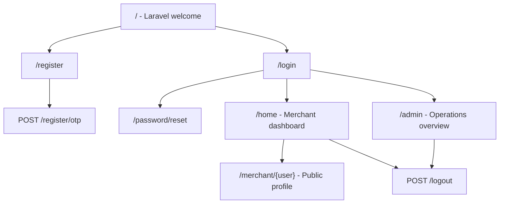
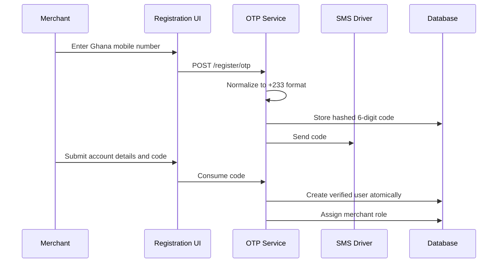

# TrustLink

TrustLink is a Laravel application for a Ghana-focused social-commerce escrow platform. The current build establishes authentication, phone OTP verification, role-based access, a merchant dashboard prototype, and an admin operations console.

Local URL: [https://trustlink.ddev.site](https://trustlink.ddev.site)

## Current Status

| Area | Status | Notes |
| --- | --- | --- |
| Authentication | Implemented | Login, logout, password reset, and password confirmation |
| Merchant registration | Implemented | Ghana phone normalization and OTP verification |
| Roles and permissions | Implemented | Spatie Permission with four roles |
| Merchant dashboard | Prototype | Uses demonstration transaction data |
| Admin overview | Prototype | Responsive operations dashboard using demonstration data |
| Public merchant profile | Prototype | Public route backed by the user model |
| Escrow domain | Planned | Orders, items, lifecycle, ledger, disputes, and payouts are not yet modeled |
| Payment provider | Planned | No live collection, holding, refund, or payout integration |
| Production SMS | Planned | Local OTP delivery currently uses the log driver |

## Site Map



### Public and Authentication Routes

| Method | Path | Name | Access | Purpose |
| --- | --- | --- | --- | --- |
| GET | `/` | - | Public | Original Laravel welcome screen |
| GET | `/login` | `login` | Guest | Admin and merchant sign-in |
| POST | `/login` | - | Guest | Authenticate a user |
| GET | `/register` | `register` | Guest | Merchant registration form |
| POST | `/register/otp` | `register.otp` | Guest, rate limited | Send a registration OTP |
| POST | `/register` | - | Guest | Verify OTP and create merchant account |
| POST | `/logout` | `logout` | Authenticated | Invalidate session and sign out |
| GET | `/password/reset` | `password.request` | Public | Request password reset |
| POST | `/password/email` | `password.email` | Public | Send password reset link |
| GET | `/password/reset/{token}` | `password.reset` | Public | Display password reset form |
| POST | `/password/reset` | `password.update` | Public | Update password |
| GET | `/password/confirm` | `password.confirm` | Authenticated | Confirm current password |
| POST | `/password/confirm` | - | Authenticated | Process password confirmation |

### Application Routes

| Method | Path | Name | Access | View |
| --- | --- | --- | --- | --- |
| GET | `/home` | `home` | Authenticated | Merchant dashboard |
| GET | `/merchant/{user}` | `merchant.show` | Public | Public merchant profile |
| GET | `/admin` | `admin.dashboard` | `access admin` permission | Admin operations overview |

Admin navigation labels for transactions, merchants, disputes, payouts, webhooks, and settings are visible design placeholders. Their routes and workflows have not been implemented yet.

## Registration and OTP Flow



OTP safeguards:

- Six-digit random code
- Code stored as a password hash
- 10-minute expiry
- 60-second resend cooldown
- Lockout after five incorrect attempts
- OTP endpoint limited to three requests per minute
- Ghana mobile numbers normalized to `+233XXXXXXXXX`
- Phone numbers are unique per user

Local OTP codes are written to `storage/logs/laravel.log`. A production SMS adapter must implement `App\Contracts\SmsSender` before deployment.

## Roles and Permissions

Roles and permissions are managed by `spatie/laravel-permission`.

| Permission | Admin | Compliance | Support | Merchant |
| --- | :---: | :---: | :---: | :---: |
| Access admin | Yes | Yes | Yes | No |
| Access merchant dashboard | Yes | No | No | Yes |
| Create escrow links | Yes | No | No | Yes |
| View transactions | Yes | Yes | Yes | No |
| View merchants | Yes | Yes | Yes | No |
| Review KYC | Yes | Yes | No | No |
| Manage disputes | Yes | No | Yes | No |
| Manage payouts | Yes | No | No | No |
| Manage users | Yes | No | No | No |

Merchant tier and KYC status are intentionally not represented as roles. They will be separate domain attributes when merchant profiles are implemented.

## Code Map

```text
app/
|-- Contracts/
|   `-- SmsSender.php                 SMS provider contract
|-- Enums/
|   |-- UserPermission.php           Permission names
|   `-- UserRole.php                 Role names
|-- Http/Controllers/
|   |-- AdminController.php          Admin dashboard data
|   |-- HomeController.php           Merchant dashboard data
|   |-- MerchantController.php       Public merchant profile
|   `-- Auth/
|       |-- LoginController.php      Role-aware login redirect
|       |-- RegisterController.php   Verified account creation
|       `-- RegistrationOtpController.php
|-- Models/
|   |-- User.php                     Authenticatable user with Spatie roles
|   `-- PhoneVerificationChallenge.php
|-- Providers/
|   `-- AppServiceProvider.php       SMS driver binding
`-- Services/
    |-- PhoneNumberNormalizer.php
    |-- PhoneVerificationService.php
    `-- Sms/LogSmsSender.php

database/
|-- migrations/                      Users, framework tables, roles, and OTP tables
`-- seeders/
    |-- DatabaseSeeder.php           Local admin and merchant accounts
    `-- RolePermissionSeeder.php     Role-permission matrix

resources/views/
|-- welcome.blade.php                Original Laravel welcome page
|-- auth/                            Login, registration, and password screens
|-- home.blade.php                   Merchant dashboard
|-- merchant/show.blade.php          Public merchant profile
|-- admin/dashboard.blade.php        Admin operations overview
`-- layouts/                         Auth, merchant, public, and admin shells

routes/web.php                       All current HTTP routes
tests/Feature/                       Auth, OTP, seeder, logout, and RBAC coverage
```

## Current Database Map

Application tables:

| Table | Purpose |
| --- | --- |
| `users` | Identity, email, phone number, and verification timestamps |
| `phone_verification_challenges` | Hashed OTP, expiry, cooldown, and attempts |
| `roles` | Spatie roles |
| `permissions` | Spatie permissions |
| `model_has_roles` | User-role assignments |
| `model_has_permissions` | Direct model permissions |
| `role_has_permissions` | Role-permission assignments |

Framework tables include sessions, cache, jobs, failed jobs, job batches, and password reset tokens.

## Technology

- PHP 8.3+
- Laravel 13
- Laravel UI authentication
- Spatie Laravel Permission 8
- MySQL in DDEV
- Vite 8
- Bootstrap 5 and Sass
- Tailwind utilities embedded or loaded by individual prototype layouts
- PHPUnit 12

## Local Setup

Requirements: Docker, DDEV, Composer, and Node.js.

```bash
ddev start
ddev composer install
ddev npm install
ddev php artisan migrate --seed
ddev npm run build
```

Open [https://trustlink.ddev.site](https://trustlink.ddev.site).

### Local Test Accounts

These accounts are created only in `local` and `testing` environments.

Admin:

```text
Email: admin@example.com
Password: TrustLinkAdmin123!
```

Merchant:

```text
Email: test@example.com
Password: TrustLinkMerchant123!
```

Admin users are redirected to `/admin`; merchants are redirected to `/home`.

## Development Commands

```bash
# Run all PHP tests
ddev composer test

# Build frontend assets
ddev npm run build

# Format PHP files
ddev exec vendor/bin/pint

# Display routes
ddev php artisan route:list --except-vendor

# Display the permission matrix
ddev php artisan permission:show

# Reseed roles and local accounts
ddev php artisan db:seed
```

## Test Coverage

The feature suite currently covers:

- Root page response and isolated Laravel welcome styling
- Deterministic, idempotent local account seeding
- Admin login redirect
- Logout visibility and session invalidation
- OTP normalization and hashing
- Successful verified merchant registration
- Invalid and expired OTP rejection
- Duplicate phone rejection
- OTP resend cooldown and attempt lockout
- Admin, compliance, and merchant authorization behavior

## Next Domain Milestones

1. Merchant profiles, tiers, KYC states, limits, and compliance documents
2. Escrow orders and itemized order lines
3. Explicit escrow lifecycle and immutable status history
4. Payment provider adapter, webhook idempotency, and reconciliation
5. Refund and payout workflows using integer pesewas
6. Dispute cases, evidence, decisions, and audit history
7. WhatsApp conversation sessions and escrow-link generation
8. Logistics handoff and delivery confirmation

Before live-money development, confirm the regulatory and contractual holding model with the selected licensed payment provider and Ghanaian legal/compliance counsel.
